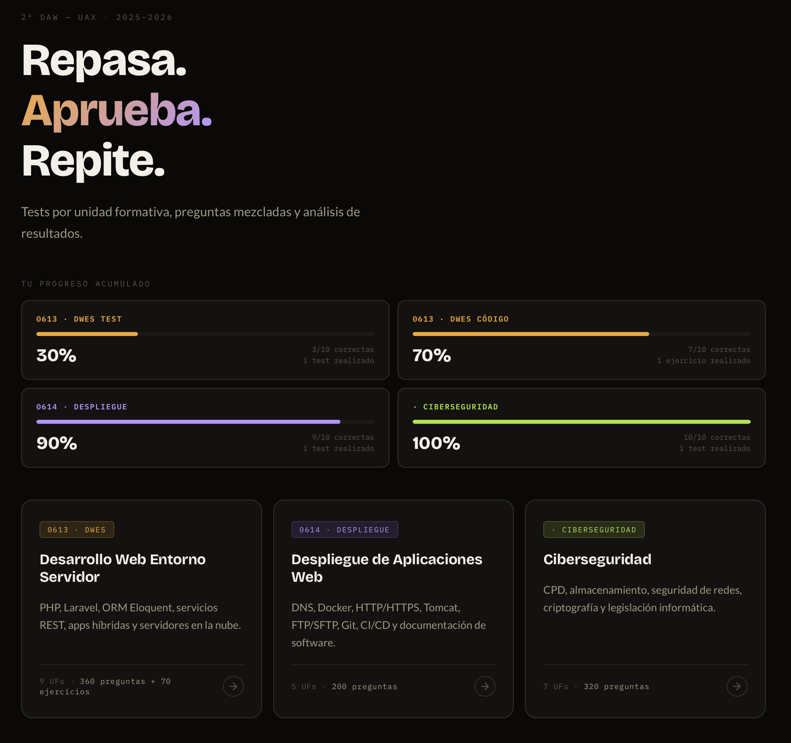

<p align="center">
  
</p>   

<!-- Título animado -->
<div align="center">
  
</div>


<h2 align="center" style="display: flex; align-items: center; justify-content: center;">
   Sobre Mí
</h2>


```javascript
/* laura.ateca.js */
const atkla = {
  role:     "Frontend Developer | UX Designer",
  location: "Madrid, España",
  building: "Nimbag — asistente de equipaje inteligente en producción",

  stack: {
    frontend: ["Vue.js", "Nuxt 3", "JavaScript", "HTML5", "CSS3", "Tailwind", "Vite"],
    backend:  ["Node.js", "PHP", "Express", "Laravel", "REST APIs"],
    data:     ["PostgreSQL", "MySQL"],
    design:   ["Figma", "UX Research", "Usability Testing"],
    tools:    ["Git", "Vercel", "Railway"]
  },

  offline: "fotografiando, viajando o buscando el mejor padthai",
};
```

<br>

<div align="center">

**¿Hablamos?**

[](https://www.linkedin.com/in/ateca-vega/)
[](mailto:ateca.vega@gmail.com)

</div>

<br>

<h2 align="center" style="display: flex; align-items: center; justify-content: center;">
   Skills & Tools
</h2>

<p align="center">
  
  
  
  
  
  
  
  
  
  
  
  
  
  
  
  
  
  
  
  
  
  
  
</p>

<br>

<h2 align="center" style="display: flex; align-items: center; justify-content: center;">
   Nimbag — en producción
</h2>


<div align="center">

*Tu asistente inteligente para preparar el equipaje perfecto.*


[](https://www.nimbag.com)


`Vue.js 3` `Pinia` `Node.js` `PostgreSQL` `API REST` `Vercel` `Railway`

</div>

<br>

<h2 align="center" style="display: flex; align-items: center; justify-content: center;">
   Mythicapp
</h2>


<div align="center">
  
*Descubre las civilizaciones más fascinantes a través de sus mitos y leyendas.*
<br>
**15 preguntas** • **6 civilizaciones** • **Demuestra tu conocimiento**


[](https://atkla.github.io/Mythicapp/)
[](https://github.com/atkla/Mythicapp)
[](https://github.com/atkla/Mythicapp/issues/new?labels=bug)

`JavaScript` `HTML5` `CSS3` `Quiz App` `Mitología`


 
Agradezco cualquier feedback o reporte de issues para seguir mejorando la aplicación.

</div>

<br>

<h2 align="center" style="display: flex; align-items: center; justify-content: center;">
   Repasa. Aprueba. Repite.
</h2>


<div align="center">
  
*Tests por unidad formativa, preguntas mezcladas y análisis de resultados.*
<br>
**360 preguntas** • **3 módulos DAW** • **Prepárate para tus exámenes**



[](https://tally.so/r/J9kj9X)

`JavaScript` `HTML5` `CSS3` `Exam Prep` `Education`


**Módulos cubiertos:** DWES (0613) • Despliegue (0614) • Ciberseguridad

</div>

<br>

<h2 align="center" style="display: flex; align-items: center; justify-content: center;">
   Estándares y Metodología
</h2>


Para mantener un código limpio y un historial de versiones profesional. Puedes descargar mi **Guía Maestra de Git** pinchando en la imagen:

<div align="center">
  <a href="https://raw.githubusercontent.com/ATKLA/ATKLA/main/assets/GIT.png">
    
  </a>
  <p><i>"Nombres claros, historial limpio, equipos felices"</i></p>
</div>

---

<p align="center">
  
</p>
