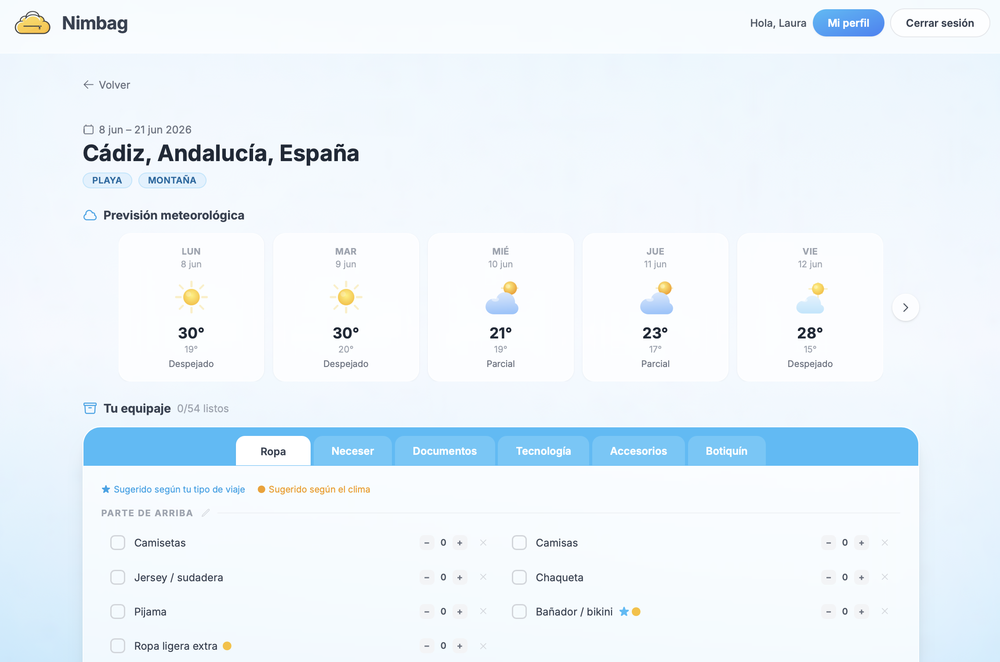
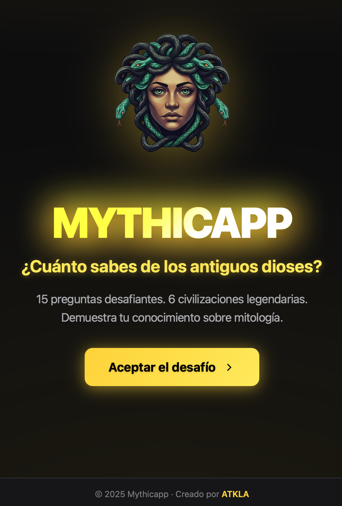

<p align="center">
  
</p>   
<!-- Título animado -->
<div align="center">
  
</div>


## 🌈 Sobre Mí

```javascript
/* laura.ateca.js */
const atkla = {
  role:     "Frontend Developer | UX Designer",
  location: "Madrid, España",
  building: "Nimbag — asistente de equipaje inteligente en producción",

  stack: {
    frontend: ["Vue.js", "Nuxt 3", "JavaScript", "HTML5", "CSS3", "Tailwind", "Vite"],
    backend:  ["Node.js", "PHP", "Express", "Laravel", "REST APIs"],
    data:     ["PostgreSQL", "MySQL"],
    design:   ["Figma", "UX Research", "Usability Testing"],
    tools:    ["Git", "Vercel", "Railway"]
  },

  offline: "fotografiando, viajando o buscando el mejor padthai",
};
```

<div align="center">

**¿Hablamos?**

[](https://www.linkedin.com/in/ateca-vega/)
[](mailto:ateca.vega@gmail.com)

</div>

## 🛠 Tecnologías que uso
<div align="center">


</div>

## ☁️ Nimbag — en producción 🚀
<div align="center">

*Tu asistente inteligente para preparar el equipaje perfecto.*



[](https://www.nimbag.com)


`Vue.js 3` `Pinia` `Node.js` `PostgreSQL` `API REST` `Vercel` `Railway`

</div>

## 🏛️ Mythicapp 
<div align="center">
  
*Descubre las civilizaciones más fascinantes a través de sus mitos y leyendas.*
<br>
**15 preguntas** • **6 civilizaciones** • **Demuestra tu conocimiento**



[](https://atkla.github.io/Mythicapp/)
[](https://github.com/atkla/Mythicapp)
[](https://github.com/atkla/Mythicapp/issues/new?labels=bug)


`JavaScript` `HTML5` `CSS3` `Quiz App` `Mitología`


 
Agradezco cualquier feedback o reporte de issues para seguir mejorando la aplicación.

</div>

---

## 🧪 Experimentos & práctica

<div align="center">

### 🔥 Practicando con Streamlit: Recetapp

[](https://recetapp.streamlit.app)

[](https://github.com/ATKLA/Recetapp)
[](https://recetapp.streamlit.app)

[](https://github.com/ATKLA/Recetapp/pulls)

`Python` `Streamlit`

### 🧮 Calculadora Retro

<a href="https://github.com/ATKLA/Retro_calculator">
  
</a>

[](https://github.com/ATKLA/Retro_calculator)
[](https://github.com/ATKLA/Retro_calculator/releases/download/v1.0/Calculadora.jar)

`Java`

</div>

---

