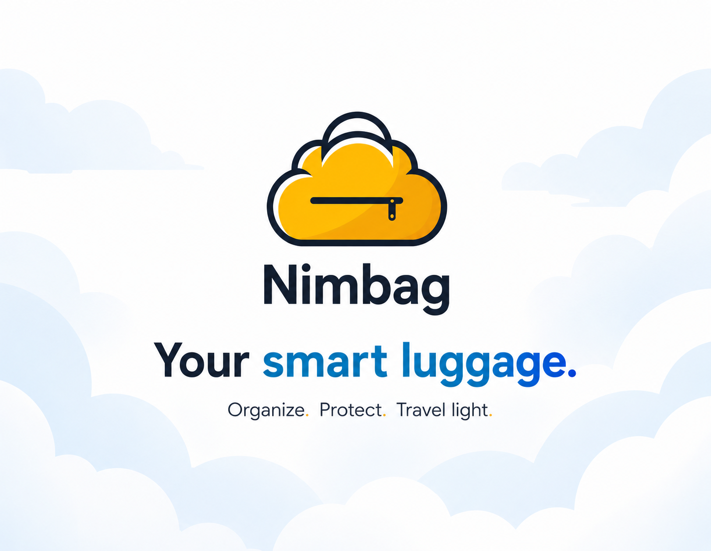
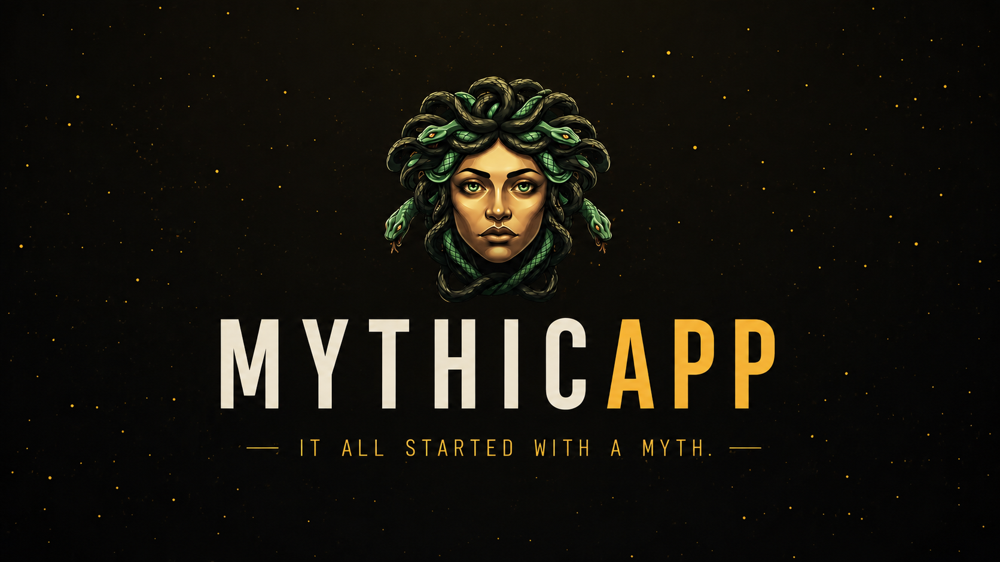
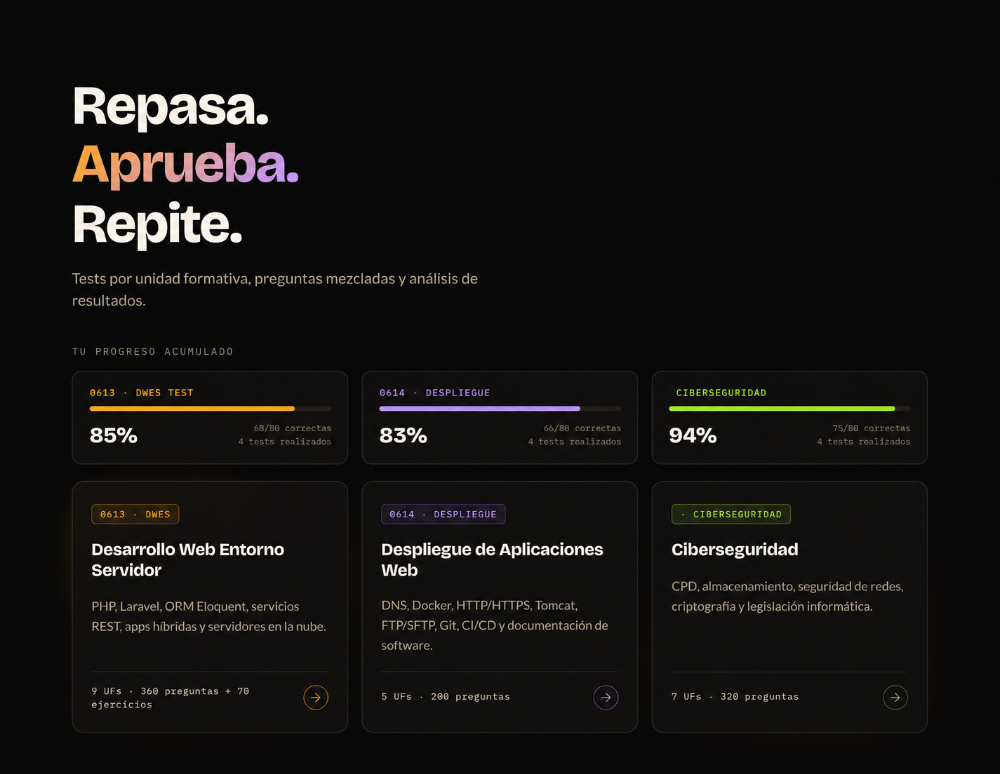

<p align="center">
  
</p>   

<!-- Título animado -->
<div align="center">
  
</div>


<h2 align="center" style="display: flex; align-items: center; justify-content: center;">
  About me
</h2>


```javascript
/* laura.ateca.js */
const atkla = {
  role:     "Frontend Developer | UX Designer",
  location: "Madrid, Spain",
  currentlyBuilding: [
    "One More Mapp — Travel planning & interactive map platform",
    "Nimbag — AI-powered travel packing assistant"
  ],

  stack: {
    frontend: ["Vue.js", "Nuxt 3", "React", "JavaScript", "HTML5", "CSS3", "Tailwind CSS", "Vite"],
    backend:  ["Node.js", "Express", "PHP", "Laravel", "REST APIs"],
    data:     ["PostgreSQL", "MySQL", "MongoDB"],
    design:   ["Figma", "UX/UI", "Accessibility"],
    tools:    ["Git", "Vercel", "Railway"]
  },

  offline: [
    "Travel",
    "Product Design",
    "Frontend Architecture",
    "Artificial Intelligence"
  ]
};
```

<br>

<div align="center">
<h2 align="center" style="display: flex; align-items: center; justify-content: center;">
  Skills & Tools
</h2>
<p align="center">


</p>
</div>


<br>


<h2 align="center">
  One More Mapp
</h2>

<div align="center">

*Your personal travel map. Plan, remember and organize every adventure in one place.*

**Plan Trips** • **Collect Countries** • **Save Places** • **Share Experiences**


[](https://onemoremapp.com)
[](https://onemoremapp.com)

`Nuxt 3` `TypeScript` `PostgreSQL` `Tailwind CSS`

Everything you need to remember, plan and share your journeys. An interactive travel map to collect visited countries, save memorable places, organize future adventures and connect with fellow travelers.

</div>

<br>


<h2 align="center" style="display: flex; align-items: center; justify-content: center;">
  Nimbag
</h2>

<div align="center">

*Your intelligent travel packing assistant.*



[](https://www.nimbag.com)


`Vue.js 3` `Pinia` `Node.js` `PostgreSQL` `API REST` `Vercel` `Railway`

</div>

<br>


<h2 align="center" style="display: flex; align-items: center; justify-content: center;">
  MythicApp
</h2>

<div align="center">
  
*It all started with a myth. Can you remember them all?*

**80 Questions** • **4 Civilizations** • **27 Myths & Legends**
 


[](https://atkla.github.io/Mythicapp/)
[](https://github.com/atkla/Mythicapp)
[](https://github.com/atkla/Mythicapp/issues/new?labels=bug)
 
`React 19` `Vite` `Tailwind CSS v4` `JavaScript`
 


An interactive mythology library featuring Egyptian, Greek, Roman and Norse mythology.

Explore legendary characters, discover original sources and challenge yourself with an 80-question quiz.

Feedback, suggestions and bug reports are always welcome!
 
</div>

<br>

<h2 align="center" style="display: flex; align-items: center; justify-content: center;">
  Exam Prep Platform
</h2>

<div align="center">
  
*Practice by learning unit, answer random questions and track your progress.*
<br>
**360 Questions** • **3 DAW Modules** • **Prepare for Your Exams**



<br>

[](https://atkla.github.io/Repaso_examenes/)

<br>

`JavaScript` `HTML5` `CSS3` `Exam Prep` `Education`

**Modules covered:** DWES (0613) • Deployment (0614) • Cybersecurity

</div>

<br>

<h2 align="center" style="display: flex; align-items: center; justify-content: center;">
  Git Workflow Guide
</h2>

Keep your repositories clean and your commit history meaningful.

You can download my **Git Workflow Guide** by clicking on the image below.

<div align="center">
  <a href="https://raw.githubusercontent.com/ATKLA/ATKLA/main/assets/GIT.png">
    
  </a>
  <p><i>"Clear names, clean history, happy teams."</i></p>
</div>

---

<p align="center">
  
</p>
