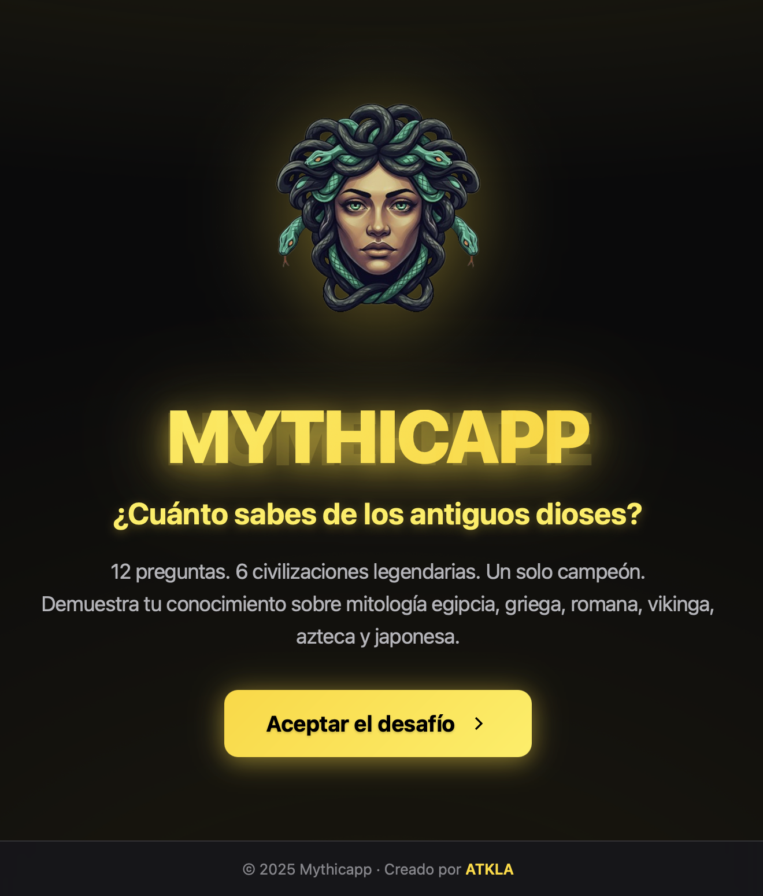

<p align="center">
  
</p>   
<!-- Título animado -->
<div align="center">
  
</div>


## 🌈 Sobre Mí

```python
class ATKLA:
    def __init__(self):
        self.name = "Laura Ateca"
        self.role = "Fotógrafa, diseñadora y Desarrolladora Full Stack en formación"
        self.passion = "Crear soluciones tecnológicas innovadoras con estilo"
        self.interests = ["Fotografía", "Viajes", "Gastronomía", "Diseño UX/UI"]
        self.design_skills = ["Diseño gráfico", "Retoque fotográfico", "Prototipado web"]

        self.tech_skills = {
            'Lenguajes': ["Java", "Python", "JavaScript"],
            'Frontend': ["HTML5", "CSS3", "Bootstrap", "React"],
            'Backend': ["Streamlit", "Java (Swing)"],
            'Bases de datos': ["SQL", "XML"],
            'Herramientas': ["Git", "GitHub", "VS Code", "PyCharm", "Docker", "SQL Developer"]
        }
        
    def say_hi(self):
        print("¡Hola! Soy Laura, desarrolladora y creativa multidisciplinar.")
        print("Cuando no estoy programando, me encontrarás:")
        print("- Capturando momentos con mi cámara 📸")
        print("- Planificando mi próximo viaje ✈️")
        print("- Explorando nuevos sabores 🍜")
        print("\n¡Gracias por visitar mi perfil! 😊")

me = ATKLA()
me.say_hi()

```

## 🛠 Tecnologías que uso
<div align="center" style="margin: 20px 0;">
  


</div>

## 🏛️ Mythicapp 
<div align="center">

  
*Descubre las civilizaciones más fascinantes a través de sus mitos y leyendas, y pon tus conocimientos a prueba.*
**15 preguntas** • **6 civilizaciones** • **Demuestra tu conocimiento**



[](https://atkla.github.io/Mythicapp/)
[](https://github.com/atkla/Mythicapp)
[](https://github.com/atkla/Mythicapp/issues/new)


`JavaScript` `HTML5` `CSS3` `Quiz App` `Mitología`

</div>

---
## 🔥 Practicando con Streamlit: Recetapp 

<div align="center">
  
[](https://recetapp.streamlit.app)

[](https://github.com/ATKLA/Recetapp)
[](https://recetapp.streamlit.app)

</div>

<div align="center">
  
[](https://github.com/ATKLA/Recetapp/pulls)


### 🧮 Calculadora Retro

<div align="center">
  <a href="https://github.com/ATKLA/Retro_calculator">
    
  </a>
<div style="display: flex; justify-content: center; gap: 10px; margin-top: 15px;">

[](https://github.com/ATKLA/Retro_calculator)
[](https://github.com/ATKLA/Retro_calculator/releases/download/v1.0/Calculadora.jar)
</div>
</div

---

## 📫 Cómo contactarme
<div align="center" style="margin: 20px 0;">
  
[](mailto:tuemail@gmail.com)
[](https://linkedin.com/in/tuperfil)

</div>

